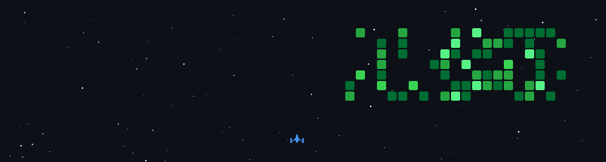

 
   

 

# Hey, I'm Abhishek **🐯**

<!--👋🐰🦍🐯🎃-->

<!--
- **⚡** Extreme High-Performance Computing & Systems Mastery.
- **🧠** Scalable Superintelligence. Cognitive + Quantum AI Engineering.
- **🤖** Autonomous Robotics & Space Tech. Next-Gen Frontier Systems.
-->
- **🎓** CS Student in &nbsp; India. Grinding Code Relentlessly Every Day.
- **🎃** Fun Fact: GPU heats my room. Winter hack.
- **📊** Codeforces: [abhishekprajapatt](https://codeforces.com/profile/abhishekprajapatt)
- **🎭** LeetCode: [abhishekprajapatt](https://leetcode.com/u/abhishekprajapatt)
- **🐰** Focus with: [VisionexApp](https://visionex-app.vercel.app)
- **📫** Reach: [Email](mailto:prajapattabhishek@gmail.com)

#### **🦍** Stacking wins:

  <picture>
    <source media="(prefers-color-scheme: dark)" srcset="https://github.com/abhishekprajapatt/abhishekprajapatt/blob/output/github-snake-dark.svg" />
    <source media="(prefers-color-scheme: light)" srcset="https://github.com/abhishekprajapatt/abhishekprajapatt/blob/output/github-snake.svg" />
    
  </picture>

  

<!--

# 📈 Skills Progress
*(Tracking my journey in AI, Systems, Quantum, Robotics & more—daily commits incoming soon!)*
| 🧠 **AI/LLM/AGI** | 💾 **Hardware/Chips** | ⚙️ **Systems/OS/Kernel** | 🎨 **Graphics/ARVR** | 📱 **Mobile/IoT Dev** | ☁️ **Cloud/Blockchain** | 🔧 **Core Tools/DevOps** | 🤖 **Robotics/Space Tech** | ⚛️ **Quantum/Advanced Computing** |
|---------------|---------------------|-------------------|-----------------|---------------|--------------------|-------------------|-----------------|-------------------|
|  |  |  |  |  |  |  |  |  |
|  |  |  |  |  |  |  |  |  |
|  |  |  |  |  |  |  |  |  |
|  |  |  |  |  |  |  |  |  |
|  |  |  |  |  |  |  |  |  |
|  |  |  |  |  |  |  |  |  |
|  |  |  |  |  |  |  |  |  |
|  |  |  |  |  |  |  |  |  |
|  |  |  |  |  |  |  |  |  |
|  |  |  |  |  |  |  |  |  |
|  |  |  |  |  |  |  |  |  |
|  |  |  |  |  | ) |  |  |  |
|  |  |  |  |  |  |  |  |  |
|  |  |  |  |  |  |  |  |  |
|  |  |  |  |  |  |  |  |  |
|  |  |  |  |  |  |  |  |  |
|  |  |  |  |  |  |  |  |  |
|  |  |  |  |  |  |  |  |  |
|  |  |  |  |  |  |  |  |  |

---
*Conquering the entire tech world—one unbreakable skill at a time. The ultimate dev legend rises! 🔥*

<!--
### 🧠 Things I code with

| **🔥 C++ System Programming** | **⚛️ MERN Full Stack** | **🌟 Next.js Full Stack** | **☕ Java Full Stack** | **☁️ Cloud & DevOps** | **🎨 Tools & Design** | **🧩 Others Basic** |
|:---:|:---:|:---:|:---:|:---:|:---:|:---:|
|  |  |  |  |  |  | 
|  |  |  |  |  |  | 
|  |  |  |  |  |  | 
|  |  |  |  |  |  | 
|  |  |  |  |  |  | 
|  |  |  |  |  |  | 
|  |  |  |  |  |  | 
|  |   |  |  |  |  | 
|  |  |  |  |  |  | 
|  |  |  |  |  |  | 
|  |  |  |  |  |  | 
|  |  |  |  |  |  | 
|  |  |  |  |  |  | 
|  |   |  |  | |  |    --->

